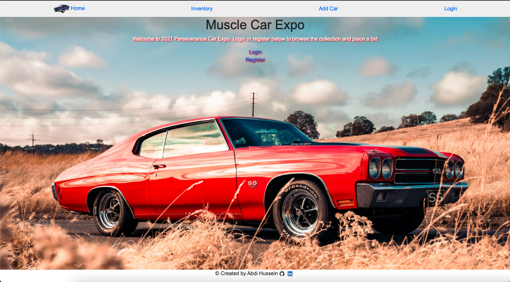
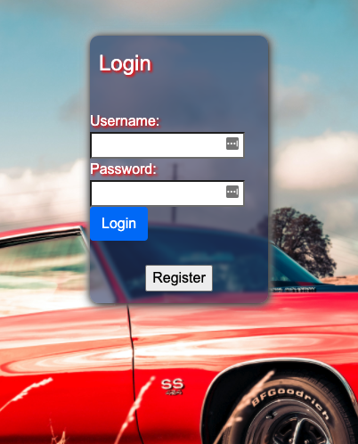
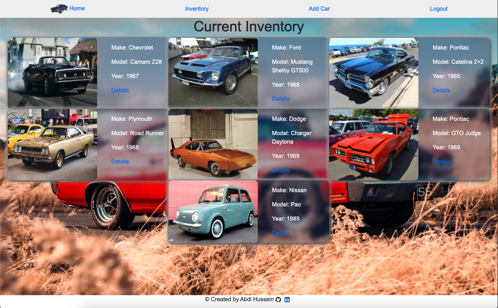
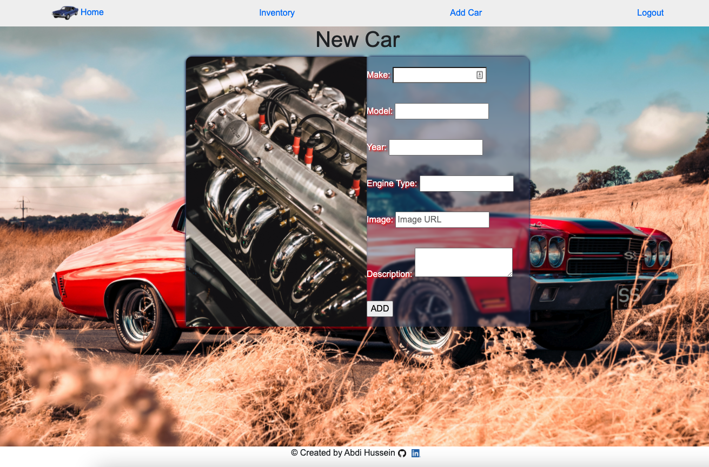
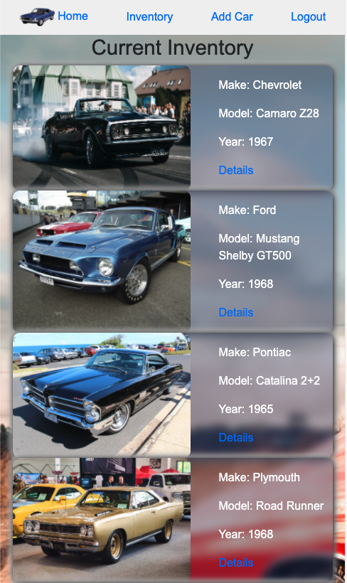
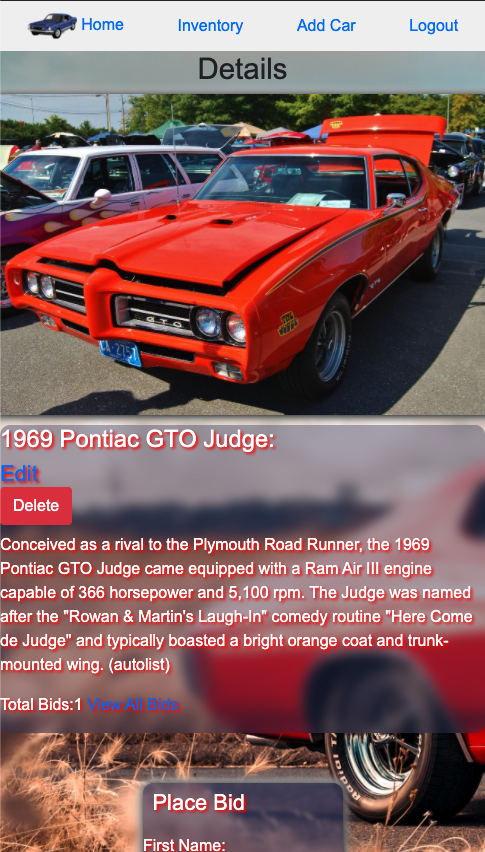
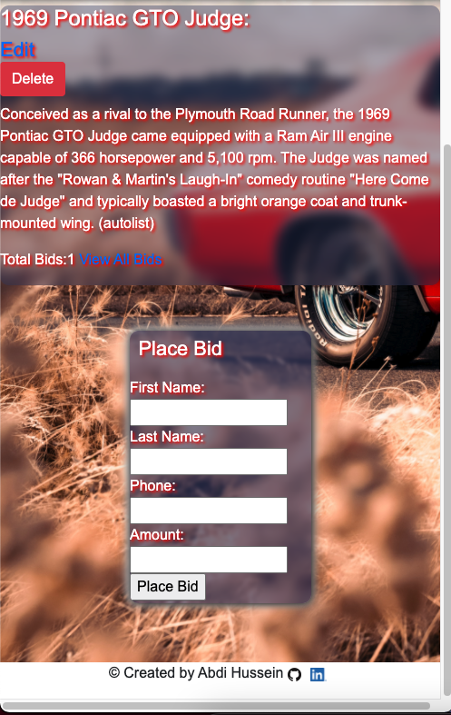
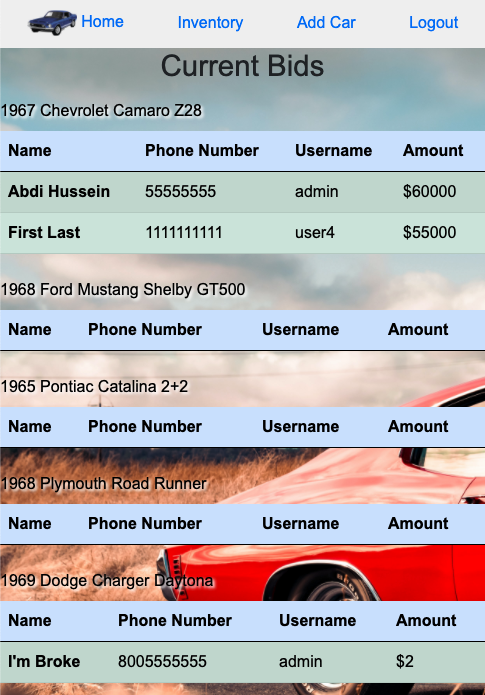

# Car Expo
This is a site to auction classic cars. Users are required to register and login in order to view the inventory and place bids. Only administrative users can make chnages to the cars and view current bids on each car.  
## Screenshots








## Technologies Used
- NodeJS
- CSS
- Mongo DB
- Bootstrap v5
- Dependecies
    - Express
    - EJS
    - Mongoose
    - Morgan
    - Express Session
    - Method Override
    - Bcrypt
    - Dotenv
- Car data from autolist.com
## Getting Started
Deployed Site: cars-expo.herokuapp.com

### Instructions
1. Clone the repo
```sh
    git clone https://github.com/abdi-hu/cars-expo.git
```
2. Install dependencies
```
    npm i
```
3. Create .env file in the main directory
4. Define DB_URL variable with Mongo DB connectino string
5. Run Nodemon on server.js

## Planned Future Enhancements
- Error Routing
- Modals
- Set requirements for data
- Oauth(PassportJS) with Google
- KBB API 
- Optomize for mobile view