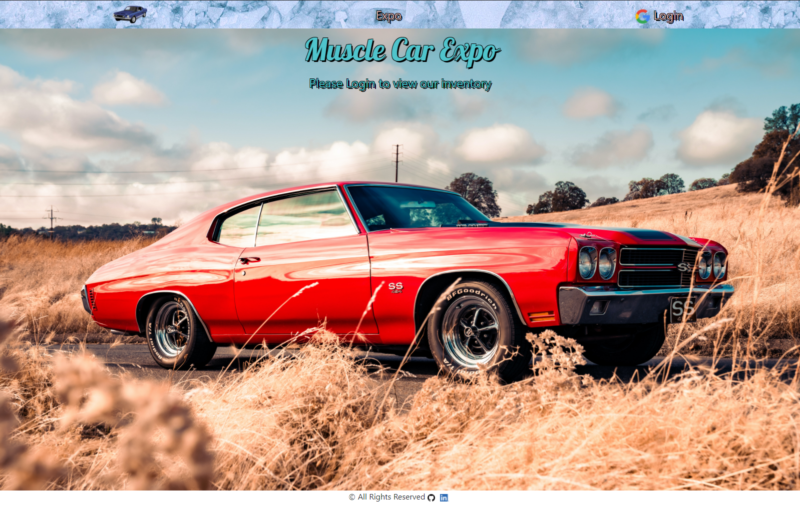
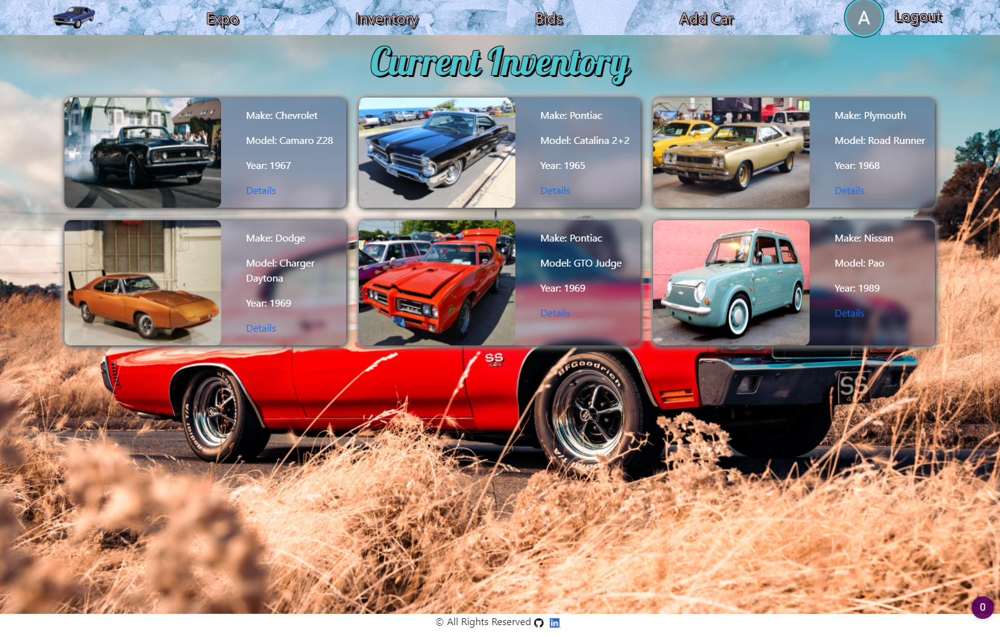
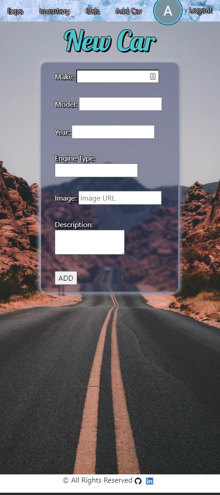
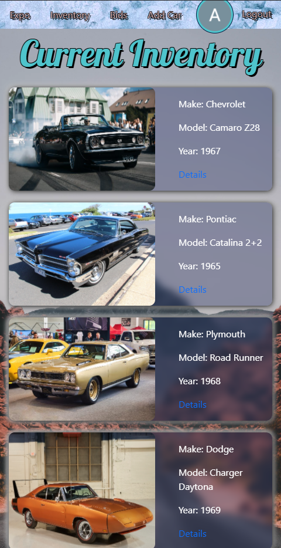

# Car Expo

### **[Live Site](https://cars-expo.herokuapp.com/)**

This is a site to auction classic cars. Users are required to login with their Google accounts in order to view the inventory and place bids. Only an administrator can make chnages to the cars and view all the bids on each car.

## Technologies Used

- NodeJS
- CSS3
- Mongo DB
- Bootstrap v5
- Dependecies
  - PassportJS
    - Google OAuth2 Strategy
  - Express
  - EJS
  - Mongoose
  - Morgan
  - Express Session
  - Method Override
  - Bcrypt
  - Dotenv
- Car data from autolist.com

## Getting Started

Deployed Site: cars-expo.herokuapp.com

## Planned Future Enhancements

- Error Routing
- Additional Oauth options for users
- Additional bidding functionality
- Modals
- Form Validation
- KBB API

## Screenshots

